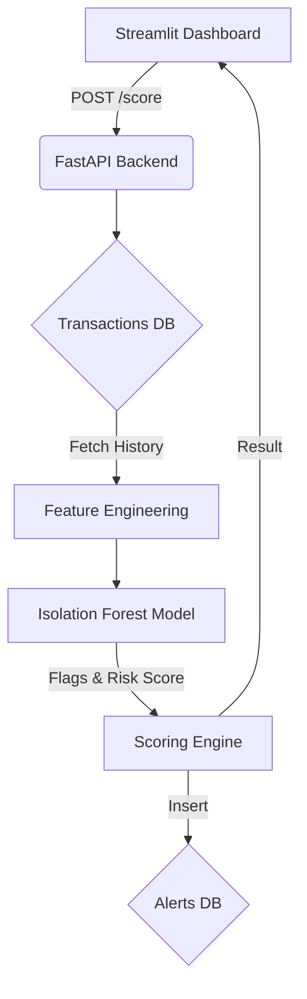

# UPI Fraud Detection with Anomaly Detection

## Overview & Problem Statement
In India's Unified Payments Interface (UPI) ecosystem, millions of transactions occur daily. Detecting fraud in real-time requires balancing precision (minimizing false alarms that frustrate users) and recall (catching actual fraud). This portfolio project builds a complete, end-to-end UPI fraud detection system from scratch using Python, FastAPI, and Streamlit, employing an unsupervised machine learning approach to catch anomalous transaction patterns without relying on labeled historical fraud data for training.

## Architecture Diagram


## Dataset
- **Synthetic Dataset**: 10,000 transactions representing ~1,000 users over 30 days.
- **Fraud Injection**: 5% contamination rate (500 fraudulent transactions) distributed across 5 patterns:
  1. `amount_spike`: Unusually large transaction for the user.
  2. `odd_hours`: Transactions between 12 AM and 5 AM.
  3. `device_city_change`: Transactions from a new city and unverified device.
  4. `velocity_burst`: High frequency of transactions within a 1-hour window.
  5. `new_receiver_repeated`: Multiple high-value payments to a brand-new receiver.

## Methodology
- **Isolation Forest (Primary Detector)**: Trained on engineered features (e.g., amount ratios, cyclic hours, transaction counts) to isolate anomalies. Chosen because it handles multidimensional anomalies well.
- **IQR & Time-Series (Boosters / Explainers)**: Initially built to boost the ensemble, these proved too noisy (precision ~12-17%). The hyperparameter grid search assigned them a weight of `0` for the final risk score. However, they are still executed to generate human-readable explanations (e.g., "Amount is 5x historical average").
- **Strict Leakage Prevention**: Features are engineered using strictly historical data (`shift()` and `expanding()` windows in batch, and `timestamp < current` in the API), guaranteeing zero data leakage.

## Evaluation Results (Test Split)

### Overall Metrics
| Method                 | Precision | Recall | F1 Score |
|:-----------------------|----------:|-------:|---------:|
| IsolationForest        | 0.71      | 0.69   | 0.70     |
| Combined (REVIEW+HIGH) | 0.71      | 0.69   | 0.70     |
| Combined (HIGH only)   | 0.77      | 0.51   | 0.61     |

### Recall per Fraud Type (Isolation Forest)
| Fraud Type            | Recall |
|:----------------------|-------:|
| odd_hours             | 1.00   |
| device_city_change    | 0.97   |
| amount_spike          | 0.79   |
| velocity_burst        | 0.54   |
| new_receiver_repeated | 0.19   |

> **Note:** The model struggles with `new_receiver_repeated` (19% recall) and `velocity_burst` (54% recall). This highlights the limitation of Isolation Forest in catching purely sequential/frequency-based attacks compared to multidimensional anomalies.

## API Usage

The backend exposes a `/score` endpoint that expects a transaction payload and returns a risk assessment (LOW, REVIEW, or HIGH).

```bash
curl -X POST http://localhost:8000/score \
-H "Content-Type: application/json" \
-d '{
  "transaction_id": "T123",
  "sender_id": "U0170",
  "receiver_id": "R0594",
  "amount": 50000.0,
  "city": "Moscow",
  "device": "UnknownDevice",
  "timestamp": "2026-10-01 03:00:00"
}'
```
**Response:**
```json
{
  "risk": "HIGH",
  "risk_score": 1.0,
  "flags": {"iqr": 1, "iso": 1, "ts_burst": 0},
  "reasons": [
    "Amount is 500.0x the user's historical average.",
    "Transaction occurred during unusual late-night hours (12 AM - 5 AM).",
    "Simultaneous new city and new device detected.",
    "First time payment to this receiver."
  ]
}
```

## How to Run Locally
1. **Install dependencies**: `pip install -r requirements.txt`
2. **(Optional) Re-train the model**: `python -m src.train`
3. **Run the API backend**: `uvicorn app:app --port 8000`
4. **Run the Dashboard**: `streamlit run dashboard.py` (in a separate terminal)

## Deployment Steps
1. **API (Render)**: Connect your repository to Render, create a Web Service, and deploy using the provided `render.yaml`.
2. **Dashboard (Streamlit Cloud)**: Deploy `dashboard.py` via Streamlit Community Cloud. In the advanced settings, set the `API_URL` environment variable to your Render URL.

## Limitations & Future Work
- **Limitations**: Trained on 30 days of purely synthetic data. Lacks concept drift handling. Uses SQLite, which is unsuitable for production concurrency.
- **Future Work**: 
  - Implement a deterministic Rule Engine layer specifically for velocity bursts.
  - Add drift monitoring and an automated retraining pipeline.
  - Migrate to PostgreSQL and Redis for low-latency feature stores.

---
### Developer Highlights
- Designed and built a modular, production-ready ML pipeline encompassing data synthesis, feature engineering, model training, and API serving.
- Eliminated training-serving skew by implementing a strict feature-parity test suite (`pytest`) that guarantees <0.001 variance between batch and real-time inference scores.
- Architected a flexible FastAPI backend integrated with an intuitive Streamlit dashboard to demonstrate real-time anomaly detection and human-readable flagging.
- Optimized hyperparameter selection via Grid Search on a hold-out validation set to maximize F1-score across 5 distinct fraud topologies.
